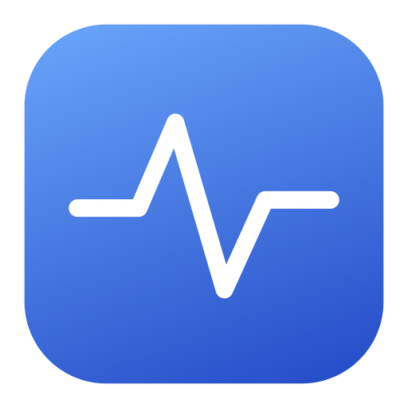
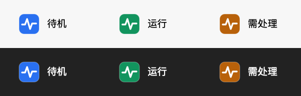

<p align="center">
  
</p>

<h1 align="center">MacBeat</h1>
<p align="center"><strong>合上盖子，工作继续。</strong><br>一个轻巧的原生 macOS 菜单栏保持唤醒工具。</p>
<p align="center">
  <a href="https://github.com/xvshiting/macbeat/releases"></a>
  
  
  
</p>
<p align="center"><a href="README.md">English</a> · <strong>简体中文</strong></p>
<p align="center">
  <a href="https://xvshiting.github.io/macbeat/zh.html"><strong>产品主页</strong></a> ·
  <a href="https://github.com/xvshiting/macbeat/releases/tag/v0.2.0"><strong>下载 DMG</strong></a> ·
  <a href="#开始使用">开始使用</a> ·
  <a href="#兼容性与实测">兼容性与实测</a> ·
  <a href="#从源码构建">从源码构建</a>
</p>

MacBeat 用来让下载、计算、本地服务等任务在你离开电脑后继续运行。开启一次会话，选择何时结束；需要合盖运行时，打开“合盖时保持运行”。它常驻菜单栏，关闭面板不会结束会话。

**系统保持唤醒，屏幕仍可正常熄灭。** MacBeat 当前不提供屏幕常亮功能。

## 功能

| 功能 | 行为 |
| --- | --- |
| 开盖保持唤醒 | 防止因长时间没有键鼠操作而自动休眠 |
| 合盖保持运行 | 可选的合盖控制，让 MacBook 合上盖子后继续工作 |
| 按时长结束 | 24 小时圆盘、小时分钟精确输入与一分钟微调 |
| 指定结束时间 | 直接选择本地日期和时间，支持跨天 |
| 手动停止 | 持续运行，直到手动结束或触发保护条件 |
| 运行中调整时间 | 修改后点击“更新结束时间”才生效 |
| 电池与温度保护 | 可选仅接电运行、低电量阈值；较高温度压力时结束会话 |
| 每日计划 | 24 小时圆盘支持多个当天时段，拖动调整与重叠合并 |
| 状态恢复 | 检测 MacBeat 会话与恢复记录，手动请求解除共享保持 |
| 登录时启动 | 未开每日定时时只待命；开启后检查当前运行时段 |

菜单栏以颜色区分状态，白色心跳线在深浅背景下都保持可见：

<p align="center"></p>

## 下载与安装

本分支包含上述 0.3.0 新界面与计划功能。目前公开下载仍为 0.2.0；体验新功能可从源码构建。

1. 前往 [Releases](https://github.com/xvshiting/macbeat/releases)，下载 `MacBeat-0.2.0-arm64.dmg`。
2. 打开 DMG，将 **MacBeat.app 拖入 Applications**。
3. 从“应用程序”打开 MacBeat，在屏幕顶部菜单栏找到心跳图标。它不显示 Dock 图标。

当前发行包面向 **Apple 芯片（arm64）**。项目的最低构建目标为 macOS 13，但完整合盖行为尚未覆盖所有系统版本；请阅读下方实测范围。

### 首次打开的系统提示

当前版本采用本地 ad-hoc 签名，**尚未使用 Developer ID 发行签名，也未经过 Apple 公证**。从互联网下载后，macOS 可能阻止首次打开；这份 DMG 不保证免提示安装。

请先确认文件来自本仓库的 Release，并核对校验值。若决定允许该应用，可参考 Apple 的[打开来自未知开发者的 Mac App](https://support.apple.com/zh-cn/guide/mac-help/mh40616/mac)说明，在系统设置中针对该应用处理提示。也可以审阅源码后自行构建，无需关闭系统的全局安全检查。

下载同一 Release 中的 `.sha256` 文件，在下载目录执行：

```sh
shasum -a 256 -c MacBeat-0.2.0-arm64.dmg.sha256
```

更新时先停止会话并退出旧版本，再替换应用。更新后重新开启保持运行。

## 开始使用

1. 点击菜单栏里的 MacBeat 图标。
2. 在“设置”中选择是否允许使用电池，以及是否开启 **合盖时保持运行**。默认仅接通电源时运行；若使用电池，请关闭此限制。
3. 选择“按时长”“到时间”或“手动停止”，点击 **开启保持运行**。
4. 图标变绿，界面显示“运行中”。面板关闭后，会话继续。
5. 到达结束时间或点击“停止保持运行”后，MacBeat 释放自己的保持请求，交还系统睡眠策略；它不会强制电脑立即睡眠。

### 每日自动开启和关闭

进入 **每日计划** 页签，在空白弧段拖动添加时段；拖动弧段两端调整起止时间，拖动中间整体平移。点击时段可精确输入时间。重叠时先预览合并后的范围，再决定是否合并。每段可独立开关、删除，最后点击 **保存每日计划**。

每天统一使用 **00:00–24:00**。夜间运行可分为 22:00–24:00 和 00:00–02:00 两段。旧版单时段设置会自动迁移，原先的跨午夜时段会拆分保留。每日计划默认关闭。

- 需要 MacBeat 正在运行，建议同时开启“登录时启动”。此功能不会唤醒已休眠的电脑，也不会给关机的电脑开机。
- 保存设置、启动应用或唤醒时，如果处于尚未执行的时段内，会补开到原定结束时间；完全错过的时段直接跳过。
- 每个时段只尝试一次。手动停止、开启失败、低电量或温度保护后，本次时段不再自动重试，重启应用也不会重复开启。需要时仍可手动开启一次会话。
- 已有手动会话时，会跳过本次定时，不修改或停止手动会话。自动关闭只结束每日定时开启的会话。
- 修改定时前请先停止当前会话，修改后需点击保存。关闭每日定时会取消后续的自动开启。
- 时间遵循本机当地日历。夏令时跳过的时刻顺延到下一有效时间，重复时刻取第一次；已经开始的会话保持原定的绝对结束时间。

### 两种运行方式

| 合盖设置 | 开盖闲置 | 合盖 | 开盖唤醒后 |
| --- | --- | --- | --- |
| 开启 | 保持系统唤醒 | 请求保持运行 | 继续当前会话；如果实际发生了系统休眠，会明确报告中断 |
| 关闭 | 防止空闲休眠 | 仍可按系统策略休眠 | 若尚未到时且运行条件允许，继续防止空闲休眠 |

屏幕变黑不等于电脑睡眠。判断任务是否持续运行，应检查任务进度、连续记录或系统休眠日志。

## 兼容性与实测

**已完成一次真实合盖测试：** 2026 年 10 月 5 日，一台 Apple 芯片 MacBook Pro，macOS 27.0（26A428），电池供电，开启合盖控制后连续合盖约 **8 分 8 秒**。独立观察程序每秒记录持续产生，检测到的休眠时间为 **0 秒**，系统日志中也没有该时间段的休眠记录。

这说明功能在上述机器与配置上有效，**不代表所有 Mac、外接显示器组合、电源切换或 macOS 版本都已经验证**。目前没有发布 Intel 预编译包。

合盖控制使用非公开 IOKit 接口。系统更新可能改变其行为；请勿同时使用其他合盖控制工具。第一次使用、更新 macOS 或改变外接设备后，建议做一次短时间合盖测试。运行时请把电脑放在通风的桌面上。

### 自己做一次合盖测试

先在 MacBeat 开启合盖会话，然后在终端启动独立观察程序（需要 Python 3）：

```sh
python3 scripts/observe-lid.py --seconds 300 --output /tmp/macbeat-lid-test.jsonl
```

合盖两分钟，再打开。观察程序不申请任何防睡眠权限，也不修改电源设置。日志字段：

- `lidClosed`：当时是否合盖。
- `gap`：与上一条记录的间隔，正常约为 1 秒。
- `sleepSeconds`：通过 macOS 连续时钟与运行时钟的差值估算累计休眠时间。

只有在确认盖子确实关闭、记录持续产生、休眠时间没有增长时，才算观察到合盖连续运行。接口返回成功或界面显示“运行中”本身不足以证明这一点。输出路径需尚不存在，以免覆盖以前的测试记录。

## 实现与恢复

界面由 **SwiftUI + AppKit** 实现。独立的 `MacBeatAgent` 持有 IOKit 防空闲休眠请求，并按设置调用合盖接口。项目没有第三方 Swift 包依赖，不发送遥测，不需要账户或网络服务。

MacBeat **不执行 `pmset disablesleep`，不写入持久电源设置**，也不会自动安装特权守护进程。测试脚本中的 `pmset -g` 仅用于读取状态。

会话会在到时、手动停止、连接断开、低电量、较高温度压力，或不满足已选电源条件时结束。独立恢复进程与本地恢复记录用于处理控制进程异常退出；失败会显示在界面中并重试。

**保持状态** 页面会区分 MacBeat 的控制会话、恢复记录和来源未知的系统合盖状态。打开页面只检测；“结束遗留保持”通过会话标识请求 MacBeat 控制进程自行停止，再处理恢复记录。“手动解除共享保持”会先说明影响并确认，不修改全局禁用睡眠设置，也不能代替其他应用释放其睡眠阻止请求。

非公开合盖接口修改的是共享系统状态，并非严格由单个进程拥有的资源。因此，多个控制工具并用、两个恢复相关进程同时被强制终止等情况无法提供绝对恢复保证。若出现恢复提示，请重新打开 MacBeat 处理；不要把接口调用成功视为所有场景下的保证。更多实现细节见 [IMPLEMENTATION.txt](IMPLEMENTATION.txt)。

## 从源码构建

需要 macOS、Swift 5.9 或更新版本及 Xcode Command Line Tools。本次发行使用 Swift 6.4 构建。

```sh
git clone https://github.com/xvshiting/macbeat.git
cd macbeat
bash scripts/build.sh
open dist/MacBeat.app
```

生成拖拽安装的 DMG：

```sh
bash scripts/package-dmg.sh
```

输出位于 `dist/`，包含 DMG 和 SHA-256 校验文件。打包脚本使用独立暂存目录，不覆盖正在运行的开发版本。默认按构建机器架构编译；没有执行 Apple 公证步骤。

### 测试

```sh
conda run -n kora swift test
```

目前有 51 项策略、计划、界面状态和恢复记录测试，覆盖旧设置迁移、多时段、午夜交接、重叠合并、弧段移动、夏令时、手动停止抑制重复启动、进程锁与会话标识匹配。

以下集成检查会短暂申请真实的电源保持请求。请先停止 MacBeat 会话，保持盖子打开，再执行：

```sh
python3 scripts/verify-agent.py
# 额外验证合盖接口的申请与恢复，不等于物理合盖测试：
python3 scripts/verify-agent.py --clamshell
```

维护者本地使用 Conda `kora` 环境时，可在测试命令前加 `conda run -n kora`。GitHub Actions 会编译、执行单元测试并生成 DMG 构建产物，不在托管运行器上修改合盖状态。

### 目录

```text
Sources/MacBeat/          菜单栏、界面和会话控制
Sources/MacBeatAgent/     电源请求与异常恢复
Sources/MacBeatCore/      时间计划、停止策略与通信数据
Tests/                   策略和界面状态测试
Resources/               应用元数据
scripts/                 构建、打包和实机观察工具
website/                 中英文产品门户页
prototype/               早期界面设计，非运行版本
```

## 产品门户页

[访问产品主页](https://xvshiting.github.io/macbeat/zh.html)。静态文件位于 `website/`，默认英文，`zh.html` 为中文。修改后推送到 `main`，GitHub Actions 会自动部署到 GitHub Pages。

本地预览：`python3 -m http.server 5181 --directory website`，然后打开 `http://localhost:5181`。

## 反馈问题

欢迎通过 [Issues](https://github.com/xvshiting/macbeat/issues) 提交反馈。请附上 macOS 版本、芯片类型、供电方式、是否接外屏、合盖设置，以及实际现象是屏幕熄灭还是任务暂停。分享日志前请移除个人信息。
